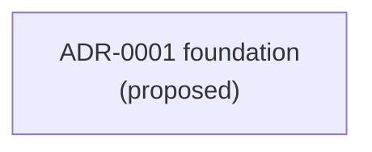

<!-- Generated by: .agent/workflows/regenerate-map.md
     At: 2026-05-25T00:00:00Z
     Source-hash: sha256:002cf79380a92273bb5ea7c0e036f36635de855bd301345a07e84672b10f1dd8
     Sources: .agent/adr/** at commit (uninitialized)
     Do not hand-edit. Run the generator. -->

# ADR Timeline

> Epoch-grouped, supersession-aware view of architecture decisions.
> Source: `.agent/adr/*`. Re-run `workflows/regenerate-map.md` after any ADR change.

## Summary

- Total ADRs: 1
- `proposed`: 1
- `active`: 0
- `superseded`: 0
- `rejected`: 0
- `ratified-retroactively`: 0

## By epoch

### epoch-0 — bootstrap

| ID | Slug | Status | Supersedes | Superseded-by | Summary |
|----|------|--------|------------|---------------|---------|
| [0001](../adr/0001-foundation.md) | foundation | proposed | — | — | 初始 stack 与分层 |

## Supersession graph

_No supersession edges yet._

## Notes

- ADR-0001 仍为 `proposed`。完成 bootstrap 时把状态改为 `active` 并填入实际 stack 选择，然后重跑本生成器。
